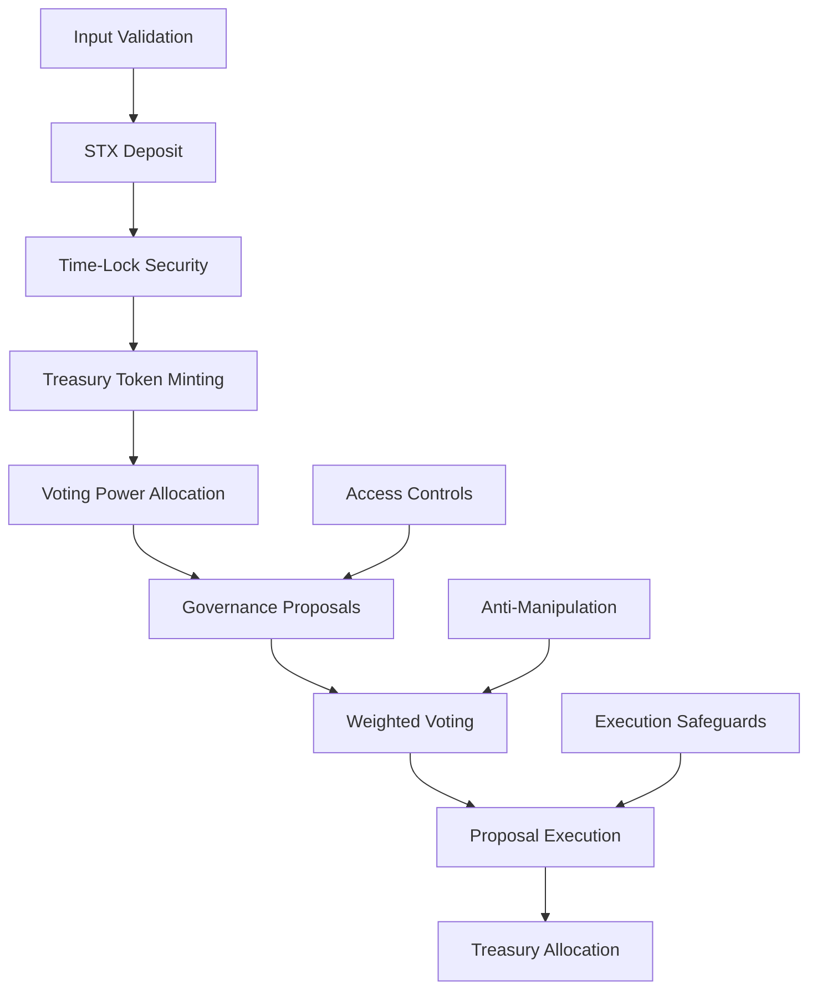

# BitVault 🏛️

## Decentralized Bitcoin Treasury Management Protocol on Stacks

[](https://opensource.org/licenses/MIT)
[](https://docs.stacks.co/clarity)
[](https://www.stacks.co/)
[](https://vitest.dev/)

## 🚀 Overview

BitVault is a sophisticated decentralized autonomous treasury protocol built on the Stacks blockchain, enabling Bitcoin-backed fund management through democratic governance and time-locked asset security mechanisms. By leveraging Bitcoin's immutable security model through Stacks Layer 2 infrastructure, BitVault revolutionizes how decentralized communities manage collective treasuries.

The protocol implements a comprehensive governance system where STX token holders can participate in treasury decisions through weighted voting, ensuring democratic fund allocation while maintaining robust security through time-lock mechanisms and anti-manipulation safeguards.

### 🎯 Key Features

- **🔒 Time-Locked Security**: STX deposits are secured through configurable time-lock mechanisms preventing immediate withdrawals
- **🗳️ Democratic Governance**: Weighted voting system based on treasury token holdings with anti-manipulation protection
- **💰 Transparent Treasury Management**: Collective fund management with proposal-based allocations and execution validation
- **🛡️ Multi-Layer Security**: Comprehensive access controls, input validation, and execution safeguards
- **⚡ Bitcoin-Backed**: Inherits Bitcoin's proven security model through Stacks blockchain integration
- **🔄 Token Economics**: Mintable/burnable treasury tokens representing proportional ownership and voting rights

## 📊 Protocol Architecture

The BitVault protocol follows a sophisticated multi-layered architecture ensuring security, transparency, and democratic governance:



### Core Components

1. **Deposit Layer**: Secure STX deposits with configurable time-locks
2. **Token Layer**: Mintable/burnable treasury tokens representing ownership
3. **Governance Layer**: Democratic proposal creation and weighted voting
4. **Security Layer**: Multi-level validation and anti-manipulation protection
5. **Execution Layer**: Automated proposal execution with safety checks

## 🛠️ Technical Specifications

### Smart Contract Details

- **Clarity Version**: 3.1 (Latest)
- **Epoch**: 3.1
- **Architecture**: Single-contract autonomous treasury
- **Security Model**: Time-locked deposits with governance-based fund allocation
- **Voting Mechanism**: Weighted voting proportional to treasury token holdings
- **Token Economics**: 1:1 STX to treasury token ratio with burn-on-withdrawal

### Protocol Parameters

| Parameter | Default Value | Description | Configurable |
|-----------|---------------|-------------|--------------|
| Minimum Deposit | 1 STX (1,000,000 μSTX) | Minimum STX required for participation | ✅ Owner |
| Lock Period | ~10 days (1,440 blocks) | Default time-lock duration for deposits | ✅ Owner |
| Min Proposal Duration | 1 day (144 blocks) | Minimum voting period for proposals | ❌ Constant |
| Max Proposal Duration | 14 days (20,160 blocks) | Maximum voting period for proposals | ❌ Constant |
| Proposal Fee | 0 STX | Cost to create proposals (stake required) | N/A |

### Error Handling

The protocol implements comprehensive error handling with descriptive error codes:

| Error Code | Constant | Description | Context |
|------------|----------|-------------|---------|
| u100 | `err-owner-only` | Function restricted to contract owner | Initialization |
| u101 | `err-not-initialized` | Protocol not yet initialized | All functions |
| u102 | `err-already-initialized` | Protocol already initialized | Initialization |
| u103 | `err-insufficient-balance` | Insufficient balance for operation | Withdrawals/Transfers |
| u104 | `err-invalid-amount` | Invalid amount specified | Input validation |
| u105 | `err-unauthorized` | Unauthorized access attempt | Access control |
| u106 | `err-proposal-not-found` | Proposal does not exist | Governance |
| u107 | `err-proposal-expired` | Proposal voting period expired | Governance |
| u108 | `err-already-voted` | User already voted on proposal | Anti-manipulation |
| u109 | `err-below-minimum` | Amount below minimum threshold | Deposits |
| u110 | `err-locked-period` | Assets still in lock period | Withdrawals |
| u111 | `err-transfer-failed` | STX transfer operation failed | Operations |
| u112 | `err-invalid-duration` | Invalid proposal duration | Governance |
| u113 | `err-zero-amount` | Zero amount not allowed | Input validation |
| u114 | `err-invalid-target` | Invalid proposal target | Governance |
| u115 | `err-invalid-description` | Invalid proposal description | Governance |
| u116 | `err-invalid-proposal-id` | Invalid proposal identifier | Governance |
| u117 | `err-invalid-vote` | Invalid vote value | Governance |

## 🏗️ Installation & Development Setup

### Prerequisites

Ensure you have the following tools installed on your development machine:

- **[Node.js](https://nodejs.org/)** (v18.0.0 or later)
- **[Clarinet](https://github.com/hirosystems/clarinet)** (latest version)
- **[Git](https://git-scm.com/)** (for version control)
- **[VS Code](https://code.visualstudio.com/)** (recommended IDE with Clarity extension)

### Quick Start Guide

1. **Clone the Repository**

   ```bash
   git clone https://github.com/bashiru-tijani/bitvault.git
   cd bitvault
   ```

2. **Install Dependencies**

   ```bash
   npm install
   ```

3. **Validate Contract Syntax**

   ```bash
   clarinet check
   ```

4. **Run Test Suite**

   ```bash
   npm test
   ```

5. **Start Interactive Development Console**

   ```bash
   clarinet console
   ```

### Development Environment Setup

For an optimal development experience:

```bash
# Install Clarinet globally
npm install -g @hirosystems/clarinet

# Install VS Code Clarity extension
code --install-extension hirosystems.clarity

# Set up file watching for tests
npm run test:watch
```

## 🧪 Testing & Quality Assurance

BitVault implements comprehensive testing using Vitest and the Clarinet SDK, ensuring robust code quality and security validation.

### Test Execution

```bash
# Run complete test suite
npm test

# Generate coverage and cost analysis reports
npm run test:report

# Watch mode for continuous testing during development
npm run test:watch

# Run specific test files
npx vitest run tests/bitvault.test.ts
```

### Test Coverage Areas

- **Core Functionality**: Deposit, withdrawal, and token management
- **Governance Mechanisms**: Proposal creation, voting, and execution
- **Security Features**: Time-locks, access controls, and validation
- **Edge Cases**: Error handling, boundary conditions, and failure scenarios
- **Integration**: End-to-end protocol workflows and state management

### Test Structure

```
tests/
├── bitvault.test.ts          # Core protocol functionality tests
├── governance.test.ts        # Governance mechanism validation  
├── security.test.ts          # Security feature verification
├── integration.test.ts       # End-to-end workflow testing
└── helpers/                  # Test utilities and fixtures
    ├── setup.ts             # Test environment configuration
    └── constants.ts         # Shared test constants
```

## 📚 API Reference & Smart Contract Interface

### Public Functions

BitVault exposes a comprehensive set of public functions for treasury management and governance:

#### Core Treasury Operations

| Function | Description | Parameters | Returns | Access |
|----------|-------------|------------|---------|---------|
| `initialize()` | Initialize the BitVault protocol | None | `(response bool uint)` | Owner Only |
| `deposit(amount)` | Deposit STX into treasury with time-lock | `amount: uint` | `(response bool uint)` | Public |
| `withdraw(amount)` | Withdraw STX after lock period expires | `amount: uint` | `(response bool uint)` | Public |

#### Governance Functions

| Function | Description | Parameters | Returns | Access |
|----------|-------------|------------|---------|---------|
| `create-proposal(...)` | Create new governance proposal | `description: string-ascii 256`<br>`amount: uint`<br>`target: principal`<br>`duration: uint` | `(response uint uint)` | Stakeholders |
| `vote(proposal-id, vote-for)` | Cast weighted vote on proposal | `proposal-id: uint`<br>`vote-for: bool` | `(response bool uint)` | Stakeholders |
| `execute-proposal(proposal-id)` | Execute approved proposal | `proposal-id: uint` | `(response bool uint)` | Public |

### Read-Only Functions

Query functions for retrieving protocol state and user information:

| Function | Description | Parameters | Returns |
|----------|-------------|------------|---------|
| `get-balance(account)` | Get user's treasury token balance | `account: principal` | `(response uint uint)` |
| `get-total-supply()` | Get total treasury token supply | None | `(response uint uint)` |
| `get-proposal(proposal-id)` | Get detailed proposal information | `proposal-id: uint` | `(response (optional proposal) uint)` |
| `get-deposit-info(account)` | Get user's deposit and lock status | `account: principal` | `(response (optional deposit-info) uint)` |
| `get-vote(proposal-id, voter)` | Check user's vote on proposal | `proposal-id: uint`<br>`voter: principal` | `(response (optional bool) uint)` |

### Data Structures

#### Proposal Object

```clarity
{
  proposer: principal,
  description: (string-ascii 256),
  amount: uint,
  target: principal,
  expires-at: uint,
  executed: bool,
  yes-votes: uint,
  no-votes: uint
}
```

#### Deposit Info Object

```clarity
{
  amount: uint,
  lock-until: uint,
  last-reward-block: uint
## 🔄 Usage Examples & Workflow Guide

### Basic Treasury Operations

The following examples demonstrate the core BitVault functionality:

#### Protocol Initialization

```clarity
;; Initialize the protocol (contract owner only)
(contract-call? .bitvault initialize)
```

#### Depositing into Treasury

```clarity
;; Deposit 10 STX into treasury (10,000,000 microSTX)
(contract-call? .bitvault deposit u10000000)

;; Check your treasury token balance
(contract-call? .bitvault get-balance tx-sender)

;; Verify deposit information and lock status
(contract-call? .bitvault get-deposit-info tx-sender)
```

#### Creating Governance Proposals

```clarity
;; Create a proposal to allocate 5 STX to a community project
(contract-call? .bitvault create-proposal 
  "Fund community development project for new DeFi tools" 
  u5000000                    ;; 5 STX in microSTX
  'SP1ABC...recipient-address ;; Target recipient
  u1440)                      ;; 10 days voting period (blocks)

;; Create proposal for infrastructure funding
(contract-call? .bitvault create-proposal
  "Server infrastructure and maintenance costs"
  u2000000                    ;; 2 STX
  'SP2DEF...infrastructure    ;; Infrastructure provider
  u2880)                      ;; 20 days voting period
```

#### Participating in Governance

```clarity
;; Vote YES on proposal #1
(contract-call? .bitvault vote u1 true)

;; Vote NO on proposal #2  
(contract-call? .bitvault vote u2 false)

;; Check your vote on a specific proposal
(contract-call? .bitvault get-vote u1 tx-sender)

;; Review proposal details before voting
(contract-call? .bitvault get-proposal u1)
```

#### Executing Approved Proposals

```clarity
;; Execute proposal #1 after voting period ends and approval
(contract-call? .bitvault execute-proposal u1)

;; Check if proposal was successfully executed
(contract-call? .bitvault get-proposal u1)
```

#### Withdrawing from Treasury

```clarity
;; Withdraw 3 STX after lock period expires
(contract-call? .bitvault withdraw u3000000)

;; Check remaining balance
(contract-call? .bitvault get-balance tx-sender)
```

### Complete Governance Workflow

A typical BitVault governance cycle follows these stages:

1. **Stake Acquisition**
   - Users deposit STX to receive treasury tokens
   - Tokens represent voting power and ownership

2. **Proposal Creation**
   - Stakeholders create funding proposals with detailed descriptions
   - Specify target recipient, amount, and voting duration

3. **Democratic Voting**
   - Community votes using weighted voting (based on token holdings)
   - Anti-manipulation protections prevent double voting

4. **Proposal Execution**
   - Approved proposals automatically execute fund transfers
   - Failed proposals remain archived for transparency

5. **Asset Management**
   - Stakeholders can withdraw funds after lock periods
   - Treasury tokens are burned upon withdrawal

### Integration Examples

#### DeFi Protocol Integration

```clarity
;; Example: Automated yield farming proposal
(contract-call? .bitvault create-proposal
  "Deploy 50 STX to yield farming protocol for 30-day term"
  u50000000                   ;; 50 STX
  'SP3XYZ...yield-protocol    ;; DeFi protocol contract
  u4320)                      ;; 30 days voting period
```

#### Community Funding

```clarity
;; Example: Developer grant proposal
(contract-call? .bitvault create-proposal
  "Grant for open-source Bitcoin tooling development"
  u15000000                   ;; 15 STX grant
  'SP4DEV...developer-wallet  ;; Developer's wallet
  u2160)                      ;; 15 days voting period
```

## 🛡️ Security Features & Architecture

BitVault implements multiple layers of security to protect user funds and ensure democratic governance:

### Multi-Layer Security Model

#### 1. Time-Lock Mechanism

- **Configurable Lock Periods**: All deposits subject to time-lock preventing immediate withdrawals
- **Commitment Assurance**: Ensures long-term participation and reduces speculative behavior
- **Lock Status Tracking**: Real-time monitoring of lock expiration through deposit info queries

#### 2. Access Control & Authorization

- **Owner-Only Functions**: Critical protocol initialization restricted to contract owner
- **Stake-Based Access**: Proposal creation requires active stake in the treasury
- **Permission Validation**: Comprehensive checks for all privileged operations

#### 3. Anti-Manipulation Safeguards

- **One Vote Per User**: Cryptographic prevention of double voting on proposals
- **Weighted Voting**: Voting power proportional to actual stake holdings
- **Vote Tracking**: Immutable record of all governance decisions

#### 4. Input Validation & Sanitization

- **Parameter Validation**: Comprehensive checks for all function inputs
- **Boundary Enforcement**: Minimum/maximum limits on deposits and proposal durations
- **Type Safety**: Clarity's built-in type system prevents common vulnerabilities

#### 5. Execution Safeguards

- **Pre-Execution Validation**: Multiple checks before proposal execution
- **Balance Verification**: Ensuring sufficient treasury funds before transfers
- **State Consistency**: Atomic operations preventing partial state updates

### Security Best Practices

#### Smart Contract Security

- **Immutable Logic**: Core protocol logic cannot be altered post-deployment
- **Transparent Operations**: All functions and state changes are publicly auditable
- **Error Handling**: Comprehensive error codes for debugging and user feedback

#### Governance Security

- **Proposal Validation**: Multi-layer validation of proposal parameters
- **Execution Timeframes**: Defined voting periods with expiration enforcement
- **Democratic Thresholds**: Majority voting requirement for proposal approval

### Audit Considerations

While BitVault has been designed with security best practices, consider these recommendations:

1. **Professional Audit**: Engage security experts for formal code review
2. **Testnet Deployment**: Extensive testing on Stacks testnet before mainnet
3. **Gradual Rollout**: Start with limited treasury size for initial deployment
4. **Community Review**: Open-source code enables community security assessment

## 🤝 Contributing to BitVault

We welcome contributions from the Stacks and Bitcoin development community! Your expertise helps make BitVault more secure, efficient, and feature-rich.

### Contribution Guidelines

#### Getting Started

1. **Fork the Repository**

   ```bash
   git fork https://github.com/bashiru-tijani/bitvault.git
   ```

2. **Create Feature Branch**

   ```bash
   git checkout -b feature/your-amazing-feature
   ```

3. **Set Up Development Environment**

   ```bash
   npm install
   clarinet check
   npm test
   ```

#### Development Workflow

1. **Write Comprehensive Tests**
   - Add test cases for new functionality
   - Ensure existing tests continue passing
   - Include edge cases and error scenarios

2. **Follow Clarity Best Practices**
   - Use descriptive variable and function names
   - Add comprehensive comments for complex logic
   - Follow consistent formatting and style

3. **Security Review**
   - Consider security implications of changes
   - Add appropriate input validation
   - Review access control mechanisms

4. **Documentation Updates**
   - Update README for API changes
   - Add code comments for new functions
   - Include usage examples where applicable

#### Submission Process

```bash
# Ensure all tests pass
npm test

# Validate contract syntax
clarinet check

# Commit your changes with descriptive messages
git commit -m "feat: add treasury yield farming integration"

# Push to your feature branch
git push origin feature/your-amazing-feature

# Open a Pull Request with detailed description
```

### Areas for Contribution

- **Testing**: Expand test coverage and add integration tests
- **Documentation**: Improve code documentation and user guides
- **Features**: Implement additional governance mechanisms
- **Security**: Enhance security measures and audit findings
- **Optimization**: Improve gas efficiency and performance
- **Integration**: Develop integrations with other DeFi protocols

### Code Style Guidelines

- **Clarity Style**: Follow official Clarity style conventions
- **Comments**: Use clear, concise comments for complex logic
- **Error Handling**: Implement comprehensive error checking
- **Testing**: Maintain high test coverage (>90%)

## 📄 License & Legal

This project is licensed under the **MIT License** - see the [LICENSE](LICENSE) file for complete details.

### License Summary

- ✅ **Commercial Use**: Use in commercial applications
- ✅ **Modification**: Modify and adapt the code
- ✅ **Distribution**: Distribute original or modified versions
- ✅ **Private Use**: Use for private/internal projects
- ❌ **Liability**: No warranty or liability guarantees
- ❌ **Trademark**: Does not grant trademark rights

### Disclaimer

BitVault is provided "as is" without warranty of any kind. Users should conduct their own due diligence and security assessments before deploying or using the protocol in production environments.

## 🔗 Resources & Community

### Official Links

- **📖 Documentation**: [Stacks Clarity Documentation](https://docs.stacks.co/clarity)
- **🔍 Explorer**: [Stacks Explorer](https://explorer.stacks.co/?chain=testnet)
- **🛠️ Development**: [Clarinet Documentation](https://docs.hiro.so/clarinet)
- **📚 Learning**: [Clarity by Example](https://claritybyexample.com/)

### Development Resources

- **🔧 Clarinet**: [Smart Contract Development Tools](https://github.com/hirosystems/clarinet)
- **⚡ Stacks.js**: [JavaScript SDK for Stacks](https://github.com/hirosystems/stacks.js)
- **🔐 Stacks Wallet**: [Official Stacks Wallet](https://wallet.hiro.so/)
- **📊 Analytics**: [Stacks Ecosystem Analytics](https://ecosystem.stacks.org/)

---

### Built with ❤️ for the Bitcoin Ecosystem

*BitVault enables truly decentralized treasury management, combining Bitcoin's unparalleled security with democratic governance principles for the next generation of decentralized autonomous organizations.*

**Secure • Democratic • Bitcoin-Native • Open Source**
